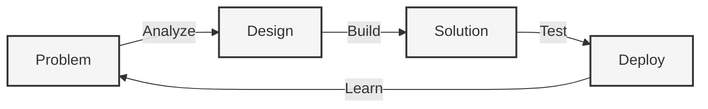

---

## <� What I Do

---

## =� Tech Stack

### Frontend

### Backend

### Tools & Platform

---

## =� Featured Work

**Click to watch** " Project showcase and development journey

---

## =� GitHub Stats

---

### =� Philosophy

> *"Code is like humor. When you have to explain it, it's bad."*
>
> Write code that speaks for itself (

 

**Let's build something amazing together** =�

